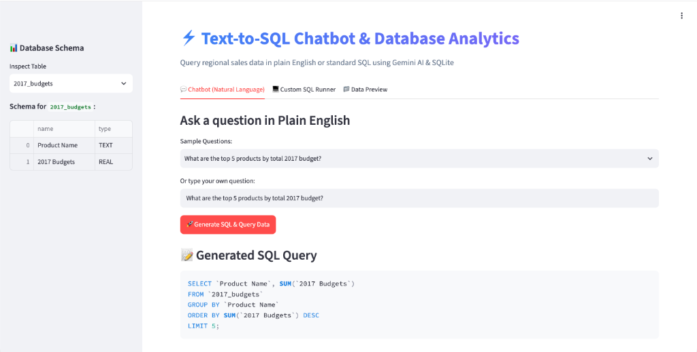
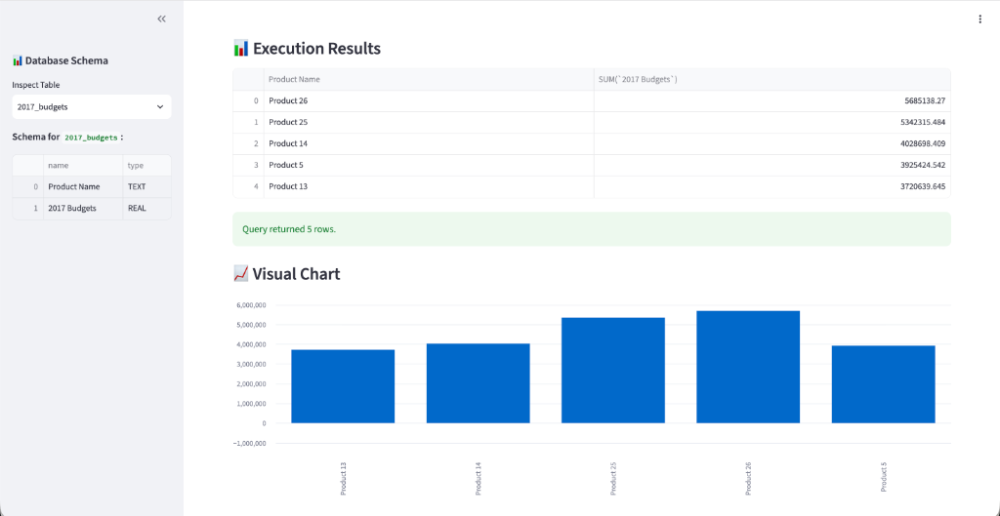
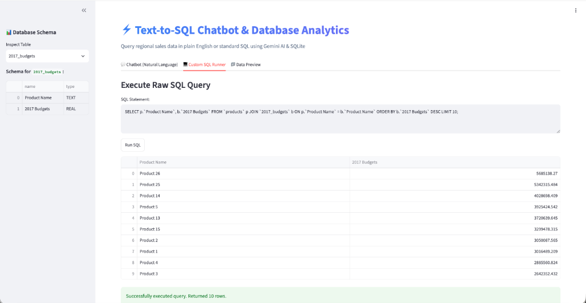
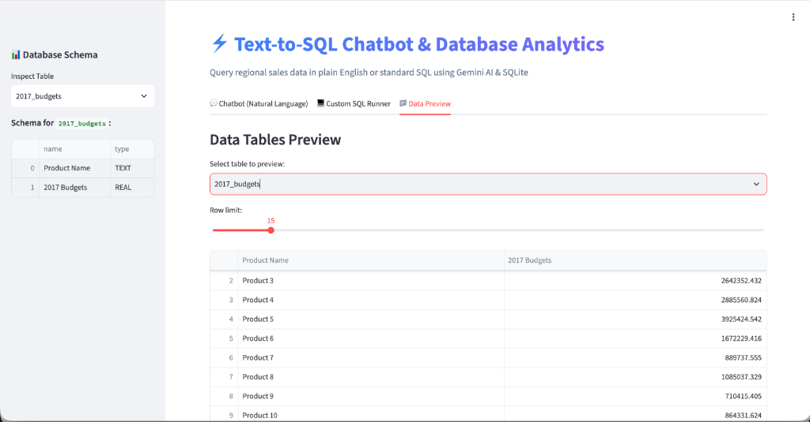

# ⚡ Text-to-SQL Chatbot & Database Analytics

A beginner-friendly, AI-powered **Text-to-SQL Chatbot** that translates natural language questions into executable SQL queries, queries an SQLite database containing regional sales data, and visualizes the results interactively. Powered by **Google Gemini 3.6 Flash** and built with **Streamlit**, **Python**, and **SQLite**.

---

## 📌 Table of Contents
- [Project Overview](#-project-overview)
- [Folder & File Structure](#-folder--file-structure)
- [Every File & Folder Explained](#-every-file--folder-explained)
- [Overall Project Flow](#-overall-project-flow)
- [Architecture Explanation](#-architecture-explanation)
- [Setup & Installation Steps](#-setup--installation-steps)
- [How to Run the Project](#-how-to-run-the-project)
- [Screenshot-Based UI Walkthrough](#-screenshot-based-ui-walkthrough)

---

## 🚀 Project Overview

The **Text-to-SQL Chatbot** bridges the gap between plain English questions and database analytics. Business users often need insights from relational databases but may not know SQL syntax.

### Key Capabilities:
1. **Natural Language to SQL Translation:** Converts questions like *"What are the top 5 products by 2017 budget?"* into valid SQLite queries using Google Gemini AI.
2. **Automated Database Schema Prompting:** Inspects SQLite tables dynamically and passes schema definitions into Gemini for accurate SQL generation.
3. **Interactive Web Dashboard:** Built with Streamlit, providing tabbed navigation for chatbot queries, custom SQL execution, and live data table browsing.
4. **Data Visualization:** Automatically renders bar charts for numeric query outputs.
5. **Command-Line Interface (CLI):** Provides a lightweight terminal app (`main.py`) for headless execution.

---

## 📂 Folder & File Structure

```
Text-to-SQL-Chatbot/
├── .env                                 # Environment configuration file (API Keys)
├── db_setup.py                          # Data ingestion script (CSV -> SQLite)
├── main.py                              # Command-Line Interface (CLI) application
├── streamlit_app.py                     # Streamlit Web GUI application
├── regional_sales.db                    # SQLite database file generated from CSVs
├── requirements.txt                     # Python dependencies list
│
├── Data_CSV/                            # Source relational data (CSV format)
│   ├── 2017_Budgets.csv                 # Annual budget figures per product
│   ├── Customers.csv                    # Customer profiles and locations
│   ├── Products.csv                     # Product catalog and names
│   ├── Regions.csv                      # Geographic regions and populations
│   ├── sales_order.csv                  # Transactional sales order records
│   └── State_Regions.csv                # State-to-region mapping table
│
├── data_dump/                           # Secondary / raw database dumps
│
├── docs/                                # Project documentation assets
│   └── screenshots/                     # UI screenshots for README
│       ├── chatbot_query.png            # Natural language query prompt & generated SQL
│       ├── query_results_chart.png      # Table results and interactive bar chart
│       ├── custom_sql_runner.png        # Raw SQL execution sandbox
│       └── data_preview.png             # Database preview and schema inspection
│
└── Notebooks/ (Root level .ipynb)
    ├── Agentic Approach.ipynb           # Experiments with agentic LLM tool call workflows
    ├── Gemini Chatbot (including RAGAS).ipynb # Accuracy evaluation using RAGAS framework
    ├── Gemini Chatbot.ipynb             # Initial prototyping notebook for Gemini LLM
    └── gemini.ipynb                     # Minimal API key and connection test notebook
```

---

## 🔎 Every File & Folder Explained

### 📄 Core Python Scripts

#### 1. [`streamlit_app.py`](file:///Users/bmaibu/Documents/Text-to-SQL-Chatbot/streamlit_app.py)
- **Purpose:** Main entry point for the Web UI built using Streamlit.
- **How it works:** 
  - Initializes database schema using `db_setup.py`.
  - Displays a sidebar schema explorer showing table structures and column types.
  - Features three main tabs: **Chatbot**, **Custom SQL Runner**, and **Data Preview**.
  - Sends user prompts to Gemini 3.6 Flash via `google-genai` SDK and executes generated SQL against `regional_sales.db`.
- **Connections:** Imports `init_db` from `db_setup.py`, reads `.env` for `GEMINI_API_KEY`, connects to `regional_sales.db`, and embeds screenshots in `docs/screenshots/`.

#### 2. [`main.py`](file:///Users/bmaibu/Documents/Text-to-SQL-Chatbot/main.py)
- **Purpose:** Terminal / Command-Line Interface (CLI) version of the chatbot.
- **How it works:**
  - Reads database schema and constructs LLM system prompts.
  - Takes natural language inputs or direct SQL commands in a continuous terminal loop.
  - Prints formatted Pandas tables directly to standard output.
- **Connections:** Uses `db_setup.py` for initialization, queries `regional_sales.db`, and reads API credentials from `.env`.

#### 3. [`db_setup.py`](file:///Users/bmaibu/Documents/Text-to-SQL-Chatbot/db_setup.py)
- **Purpose:** Automated database initialization script.
- **How it works:**
  - Reads CSV datasets located in `Data_CSV/`.
  - Converts CSV files into SQLite database tables (`2017_budgets`, `customers`, `products`, `regions`, `sales_order`, `state_regions`).
  - Writes data directly into `regional_sales.db`.
- **Connections:** Called automatically during app startup by `streamlit_app.py` and `main.py`.

---

### ⚙️ Configuration & Storage

#### 4. [`.env`](file:///Users/bmaibu/Documents/Text-to-SQL-Chatbot/.env)
- **Purpose:** Stores secret environment variables.
- **Content:** Contains `GEMINI_API_KEY=your_api_key_here`.
- **Connections:** Loaded by `python-dotenv` in `streamlit_app.py` and `main.py`.

#### 5. [`regional_sales.db`](file:///Users/bmaibu/Documents/Text-to-SQL-Chatbot/regional_sales.db)
- **Purpose:** Embedded SQLite relational database.
- **How it works:** Holds 6 relational tables populated from `Data_CSV/`.

#### 6. [`requirements.txt`](file:///Users/bmaibu/Documents/Text-to-SQL-Chatbot/requirements.txt)
- **Purpose:** Lists all Python library dependencies (`streamlit`, `google-genai`, `pandas`, `python-dotenv`).

---

### 📁 Data & Asset Folders

#### 7. [`Data_CSV/`](file:///Users/bmaibu/Documents/Text-to-SQL-Chatbot/Data_CSV)
- **`2017_Budgets.csv`**: Budget allocations for products in 2017.
- **`Customers.csv`**: Customer names, channels, and region links.
- **`Products.csv`**: List of products sold.
- **`Regions.csv`**: Geographic regions, state mappings, and population counts.
- **`sales_order.csv`**: Individual transaction line items, quantities, and totals.
- **`State_Regions.csv`**: US state codes mapped to sales regions.

#### 8. [`data_dump/`](file:///Users/bmaibu/Documents/Text-to-SQL-Chatbot/data_dump)
- Contains backup files and raw exported datasets.

#### 9. [`docs/screenshots/`](file:///Users/bmaibu/Documents/Text-to-SQL-Chatbot/docs/screenshots)
- Stores UI walkthrough screenshots referenced in this README documentation.

---

### 📓 Jupyter Notebooks (Research & Prototyping)

- **`Gemini Chatbot.ipynb`**: Original prompt engineering and Text-to-SQL experimentation.
- **`Gemini Chatbot (including RAGAS).ipynb`**: Evaluates LLM SQL output quality using RAGAS metrics.
- **`Agentic Approach.ipynb`**: Explores multi-step agentic tool calling for complex database workflows.
- **`gemini.ipynb`**: Quick testing notebook for Google Gemini API key validation.

---

## 🔄 Overall Project Flow

```
[User Question] 
       │
       ▼
[Streamlit UI / CLI] ──► Reads Database Schema ──► [PRAGMA table_info]
       │                                                 │
       ▼                                                 ▼
[Gemini 3.6 Flash LLM] ◄────── Combines Prompt + Schema ──┘
       │
       ▼ (Generates clean SQL block)
[SQLite Database Execution (regional_sales.db)]
       │
       ▼
[Pandas DataFrame Result] ──► Renders Table & Visual Chart in Streamlit
```

1. **Input:** User inputs a natural language question (or selects a preset question).
2. **Schema Ingestion:** `streamlit_app.py` extracts current table names and columns from `regional_sales.db`.
3. **Prompt Construction:** The schema and user question are wrapped in a structured system prompt instructing Gemini to return ONLY valid SQL.
4. **AI Generation:** Gemini 3.6 Flash translates the intent into standard SQL syntax.
5. **Execution:** SQLite executes the query against `regional_sales.db`.
6. **Visualization:** Pandas formats query rows, and Streamlit dynamically renders interactive data tables and bar charts.

---

## 🏗️ Architecture Explanation

The application follows a clean 4-tier modular architecture:

```
┌─────────────────────────────────────────────────────────────┐
│                    User Interface Layer                     │
│    Streamlit Web Dashboard (Tabs, Sidebar Schema, Charts)   │
└──────────────────────────────┬──────────────────────────────┘
                               │
┌──────────────────────────────▼──────────────────────────────┐
│                     AI / Intelligence Layer                 │
│         Google Gemini 3.6 Flash LLM (google-genai)          │
└──────────────────────────────┬──────────────────────────────┘
                               │
┌──────────────────────────────▼──────────────────────────────┐
│                    Database Engine Layer                    │
│      SQLite Query Processing Engine (regional_sales.db)     │
└──────────────────────────────┬──────────────────────────────┘
                               │
┌──────────────────────────────▼──────────────────────────────┐
│                     Data Ingestion Layer                    │
│        Data_CSV DataSets ──(db_setup.py)──► SQLite Tables   │
└─────────────────────────────────────────────────────────────┘
```

- **Separation of Concerns:** Data setup (`db_setup.py`) is decoupled from query logic (`main.py` & `streamlit_app.py`).
- **Security & Safety:** System prompts enforce read-only `SELECT` queries to prevent inadvertent data modification.

---

## ⚙️ Setup & Installation Steps

### Prerequisites
- Python 3.9 or higher installed on your system.
- Google Gemini API Key (Get one from [Google AI Studio](https://aistudio.google.com/)).

### Step 1: Clone the Repository
```bash
git clone https://github.com/your-username/Text-to-SQL-Chatbot.git
cd Text-to-SQL-Chatbot
```

### Step 2: Create a Virtual Environment
```bash
# macOS / Linux
python3 -m venv venv
source venv/bin/activate

# Windows
python -m venv venv
venv\Scripts\activate
```

### Step 3: Install Dependencies
```bash
pip install -r requirements.txt
```

### Step 4: Configure API Credentials
Create a `.env` file in the root directory:
```bash
GEMINI_API_KEY="your_actual_gemini_api_key_here"
```

---

## ▶️ How to Run the Project

### Option A: Run Streamlit Web App (Recommended)
Launch the interactive web UI:
```bash
streamlit run streamlit_app.py
```
Or:
```bash
python3 -m streamlit run streamlit_app.py
```
Open your browser at `http://localhost:8501`.

---

### Option B: Run Command-Line Interface (CLI)
Run the chatbot directly inside your terminal:
```bash
python3 main.py
```

---

### Option C: Re-initialize SQLite Database
To rebuild `regional_sales.db` from scratch using the CSV files in `Data_CSV/`:
```bash
python3 db_setup.py
```

---

## 🖼️ Screenshot-Based UI Walkthrough

### 1. Natural Language Chatbot & SQL Generation


- **Sidebar Schema Inspector:** Displays table structures (e.g., `2017_budgets` with columns `Product Name` and `2017 Budgets`).
- **Preset Questions:** Quick dropdown selection for sample questions.
- **Generated SQL Query:** The AI generates a clean, formatted SQL block (`SELECT Product Name, SUM(2017 Budgets) FROM ...`).

---

### 2. Execution Results & Data Visualization


- **Interactive Table:** Displays exact query output rows formatted via Pandas.
- **Automated Charting:** Automatically generates responsive bar charts for quantitative insights (e.g., top budget products).

---

### 3. Custom SQL Runner


- Allows developers and analysts to test raw SQL commands against `regional_sales.db` directly within the UI.

---

### 4. Data Preview & Database Inspector


- Allows users to preview live tables with interactive row limit sliders (5 to 100 rows).
